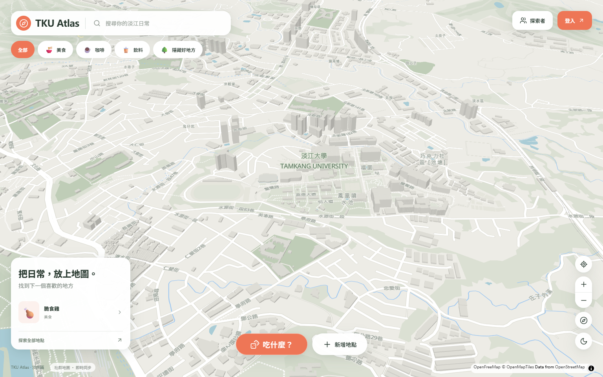
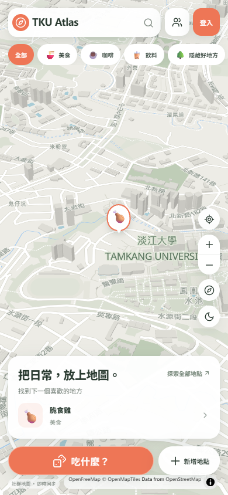
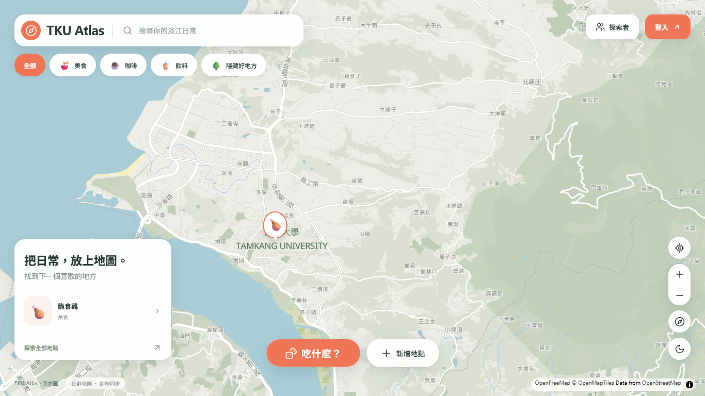

# TKU Atlas｜把日常，放上地圖

以淡江大學生活圈為起點、涵蓋整個淡水區的互動地圖作品。透過地點分享與「吃什麼？」轉盤，探索校園周邊與淡水日常。

**[直接體驗網站](https://tku-atlas.oliverchenovo.chatgpt.site)** · [技術設計](docs/ARCHITECTURE.md) · [驗證與限制](docs/VALIDATION.md) · [作品摘要](docs/PORTFOLIO.md)

> 本倉庫供個人作品集與研究所推甄展示。完整原始碼保存在獨立私有倉庫；本倉庫不包含可部署的網站程式或資料庫設定。網站可公開瀏覽，寫入功能需登入。專案仍在持續驗證，以下區分已實作與已實際驗證的能力。

網站開場採用傾斜視角，呈現淡江校園與周邊的 3D 建築。模型由地圖建築資料擠出呈現，並非逐棟手工建模。

## 為什麼做這個作品

學生生活中的餐飲、聚會與日常地點，適合用空間位置而非單純清單探索。TKU Atlas 嘗試把地點發現、個人標記與選餐決策放在同一個地圖介面，並處理登入、資料保存、地點所有權及手機操作等完整應用問題。

## 操作體驗

- 直接進入可縮放、旋轉的地圖，支援日夜主題與 3D 建築。
- 以表情符號地點呈現社群內容，支援搜尋、分類、探索者與地點目錄。
- 已實作地點建立、檢視、編輯、刪除，以及圖片、按讚與留言流程；完整多帳號雲端整合仍待驗證。
- 「吃什麼？」依食物標籤篩選候選地點，再以轉盤選擇並導向地圖。
- 開場保留淡江校園視角；右側定位按鈕可查看整個淡水區。
- 提供地點深層連結與桌面／手機版配置。

上方開場截圖攝於 2026-10-04 的正式網站，使用桌面（1536×960）與手機尺寸（390×844）Chromium；不代表實體 iPhone 或 Android 已通過測試。

### 淡水全區總覽

按右側定位按鈕可切換至全區總覽，查看完整服務範圍。下圖為 2026-10-03 的正式站截圖。

## 技術與設計重點

| 層面 | 選擇與目的 |
| --- | --- |
| 前端 | React、TypeScript、Vite；地圖與功能模組分開載入 |
| 地圖 | MapLibre GL JS、OpenFreeMap；真實地理資料、地點聚合與 3D 建築 |
| 雲端 | Supabase Auth、PostgreSQL、Storage、Realtime 整合實作 |
| 資料完整性 | PostgreSQL 約束、原子寫入、所有權與 RLS 政策 |
| 地理範圍 | NLSC 淡水區行政界線，前端與資料庫使用一致的範圍判斷 |
| 驗證 | Vitest、PGlite、Playwright；區分本機測試與實際 HTTPS／Supabase 請求 |
| 部署 | ChatGPT Sites，正式網站使用 HTTPS |

## 可查核的成果

截至 2026-10-03，77 項獨立測試案例在成功測試批次中通過：56 項單元／資料庫、15 項本機 E2E、2 項正式建置測試、4 項真實 HTTPS 網站測試。另有 8 項 hosted 地理檢查與 7 項匿名寫入拒絕檢查通過；lint、型別檢查與正式建置通過。

上述結果不等同完整正式環境驗收。真實雙帳號 CRUD／Realtime、Storage 上傳刪除與失敗恢復、已登入跨使用者攻擊，以及實體 Safari／Android 仍待驗證。詳見[驗證紀錄](docs/VALIDATION.md)。

## 開發方式與作品歸屬

本作品使用 AI 輔助開發（Codex），包括程式實作、測試與除錯。專案方向、需求與範圍調整由作品作者提出；作品展示保留具體技術決策、測試證據與限制，供審查者評估。程式碼不公開；如需學術審查，可透過 GitHub 個人頁聯絡作者另行安排。

作者：[oliverchenOVO](https://github.com/oliverchenOVO)

## 版權與第三方來源

本倉庫僅供作品展示與學術審查。本人原創程式、設計及展示素材保留所有權利；未經書面同意，不授予修改、散布、重新部署或其他再利用的授權。GitHub 平台依其條款提供的查看與 Fork 權利仍適用。詳見 [LICENSE](LICENSE)。

第三方套件、地圖、行政界線與圖示的權利不屬於本作品作者，依各自授權處理。來源與聲明見 [THIRD_PARTY_NOTICES.md](THIRD_PARTY_NOTICES.md)。
