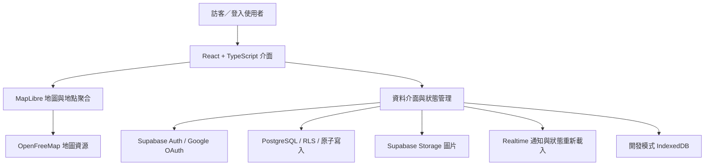

# 技術設計

本頁描述設計與實作，不提供完整原始碼、資料庫遷移或部署憑證。

## 地理範圍與資料完整性

淡水區範圍取自 NLSC 鄉鎮市區界線資料，識別碼 65000100。保留 2,767 個界線頂點；前端放置檢查與 PostgreSQL 寫入檢查採用相同範圍。資料庫亦限制有效經緯度，避免僅依賴介面驗證。

擴展範圍時，本機實際 SQL 寫入測試發現：即使多邊形已更新，舊的校園經緯度欄位約束仍阻擋淡海地點。以追加遷移修復，保留既有地點、所有權與 RLS。這是將「可顯示」與「可實際保存」分開驗證的例子。

## 地圖與介面

地圖動畫由 MapLibre 處理，避免讓每個動畫影格進入 React 狀態更新。地點聚合由地圖 worker 計算；功能模組延後載入。桌面使用側邊面板，手機使用底部面板，保留鍵盤焦點與減少動畫偏好。

全區總覽的截圖測試等待 MapLibre 在最終縮放值觸發 idle；僅等待網路閒置可能在地圖瓦片完成繪製前截圖。

## 寫入、圖片與同步

已實作原子地點寫入、圖片／標籤關聯保存、所有權檢查、版本衝突檢查與唯一按讚關係。圖片流程含客戶端縮圖、暫存預約與失敗清理機制。Realtime 通知合併後重新取得權威資料，以重連、頁面可見性與輪詢恢復遺漏事件。

上述為設計與實作狀態。Storage 真實上傳刪除、登入後跨帳號權限與兩個實際 session 的同步尚未完成 hosted 驗證，不能由架構圖推論其已通過驗收。

## 本機與正式環境

IndexedDB 只用於開發示範，身分與資料限制於同一瀏覽器／來源；不視為共享登入。正式網站使用 Supabase，沒有自動將本機 DEMO 地點匯入雲端。
